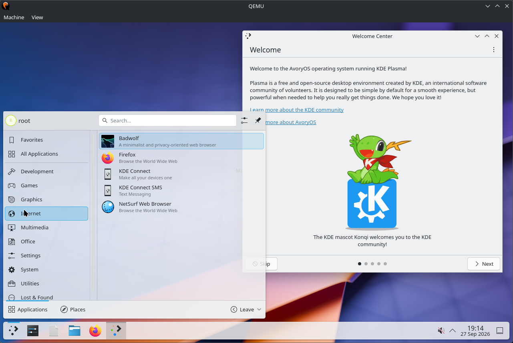
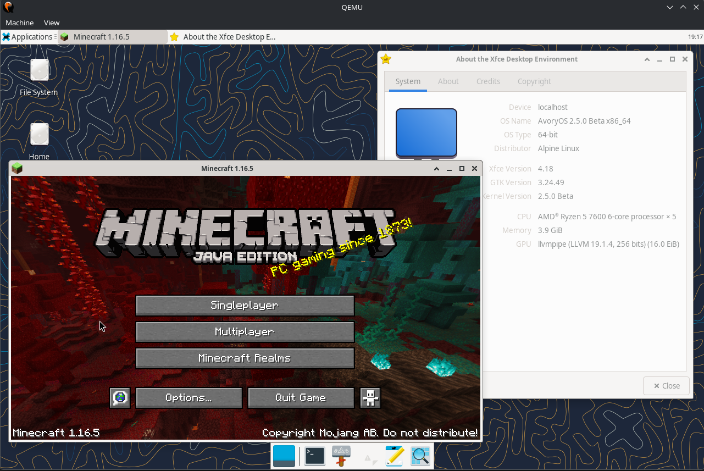

# AvoryOS




**AvoryOS** is an open-source, monolithic hobby operating system kernel for the **x86_64** architecture, written in C and Assembly. It features a rich Linux-compatible system call interface, POSIX userland compatibility, dual musl/glibc runtimes, native IPv4 & IPv6 networking, a LinuxKPI compatibility subsystem for upstream Linux DRM drivers, and modern desktop environments including KDE Plasma 6, XFCE4, IceWM, and Weston/Wayland.

---

## Highlights & Features

- **Kernel Architecture**:
  - 64-bit higher-half kernel booting via the **Limine bootloader protocol**.
  - Advanced Physical Memory Management (PMM) with per-CPU page caches and NUMA/node awareness.
  - Virtual Memory Manager (VMM) supporting 4-level paging, PCID hardware tagging, hugepages, copy-on-write, demand paging, and batched TLB shootdowns.
  - SMP Preemptive Scheduler with multi-core APIC/IPI support, futexes (including priority inheritance), signals, and POSIX threads.
  - VFS layer with page cache, dentries, ext2/ext4, ramfs, tmpfs, devtmpfs, procfs, and sysfs.
  - Userland access optimizations (`fast_copy_user`), vDSO page, and fast syscall handling (`syscall`/`sysret`).

- **Hardware, Storage & Driver Support**:
  - **Storage & Partitioning**:
    - Full **NVMe** driver (PCIe Gen3/Gen4/Gen5) with namespace discovery and command queueing.
    - Full **GPT (GUID Partition Table)** partitioning support alongside legacy MBR.
    - AHCI (SATA), IDE/ATA, and ramdisk boot support.
  - **Audio**: Intel High Definition Audio (HDA), AC97, and Sound Blaster 16 (`/dev/dsp`).
  - **Graphics & Input**:
    - Native `ascentdrm` framebuffer / VirtIO-GPU DRM backend with hardware cursor and display management.
    - **LinuxKPI Subsystem**: Compatibility layer running unmodified upstream Linux kernel drivers (PCIe VFIO passthrough, DRM/TTM/dma-buf subsystems, and experimental AMDGPU support).
    > [!NOTE]
    > **AMDGPU status**: The LinuxKPI amdgpu hardware bring-up and mode-setting pipeline is partially implemented / work-in-progress; hardware 3D rendering with radeonsi remains experimental and half-broken on bare metal/passthrough setups. Stable sessions use the native VirtIO-GPU / GOP framebuffer path or Mesa llvmpipe/pixman software renderers.
    - Evdev input subsystem supporting PS/2, USB HID keyboards, and mice.
  - **Networking (IPv4 & IPv6)**:
    - Realtek RTL8139 NIC driver with an in-kernel network stack.
    - Dual-stack **IPv4 and IPv6** support: Neighbor Discovery (NDP), ICMPv6, SLAAC link-local/global addressing, and IPv6 UDP/TCP socket layer (`AF_INET6`).

- **Userland & Compatibility Ecosystem**:
  - **Development Toolchains & C Runtimes**:
    - **GCC (GNU Compiler Collection)** installed inside the Alpine rootfs (`gcc`, `g++`, `binutils`, `make`) for compiling native C/C++ programs directly on the OS.
    - **musl-libc**: Lightweight static and dynamic userspace binaries.
    - **glibc**: Dynamic GNU libc sysroot with support for standard Linux binaries.
    - **Tiny C Compiler (TCC)**: Fast C99 compiler ported for instant builds.
  - **Alpine Linux Rootfs Integration**: Runs userspace applications directly from Alpine packages (v3.21/v3.22) managed through the built-in APM package manager.
  - **Desktop Environments & Window Managers**:
    - **KDE Plasma 6** (KWin on X11 / Wayland) & KDE Frameworks 6 applications (Dolphin, Konsole, Kate, KCalc, etc.).
    - **XFCE4** and **IceWM** lightweight desktop sessions.
    - **AetherDE**: Custom native desktop environment (AetherWM, Aether-Dock, Aether-Panel, Wayland compositor).
    - **Weston** (Wayland display server) with GPU acceleration via Mesa Gallium or software rasterization (pixman / llvmpipe).
    - **Xorg Server** with modesetting and evdev drivers.
  - **Ported Applications & Games**:
    - **Native Minecraft (up to 1.16.5)**: Bundled and staged via OpenJDK 17 with full LWJGL/OpenGL client libraries, textures, and Mojang asset sound indices (`scripts/setup-minecraft.sh`).
    - **Mocktail (Roblox Client)**: Bundled AppImage runtime and payload integration for Roblox on AvoryOS (`scripts/setup-mocktail.sh`).
    - **Web Browsers**: **Firefox** (full desktop browser with GTK and WebKit/Gecko support).
    - **Games & Emulators**: Yamagi Quake II (with demo campaign), DOOM (native fb and X11 backends), ClassiCube (Minecraft classic client), Butterscotch (GameMaker engine), TinyGL gears.
    - **Media & Utilities**: VLC media player, cmus, fastfetch, GNU Bash 5.3, GNU Coreutils, and Kria programming language.

---

## Prerequisites

To build and run AvoryOS on a Linux host (Ubuntu/Debian, Arch, Fedora, Alpine, etc.), make sure the following dependencies are installed:

- **Build Tools**: `make`, `gcc` or `clang`, `nasm`, `bison`, `flex`, `patch`
- **Host Utilities**: `git`, `curl`, `tar`, `gzip`, `bzip2`, `xz-utils`, `python3`, `e2fsprogs` (`mkfs.ext4`, `debugfs`, `e2fsck`, `resize2fs`), `parted` or `util-linux` (`sfdisk`, `losetup`)
- **ISO Creation**: `xorriso`
- **Emulation**: `qemu-system-x86_64` (with KVM support recommended)

---

## Getting Started

### 1. Bootstrap Dependencies & Toolchains

Run the bootstrap script to pull protocol headers, runtime submodules, and prepare the musl and glibc cross-compilation sysroots:

```bash
./bootstrap.sh
```

### 2. Build the Alpine Root Filesystem

Populate the root filesystem with packages (X11, KDE/XFCE/IceWM, Mesa, GCC toolchain, Firefox, fonts, and core utilities):

```bash
./scripts/setup-alpine.sh
```

### 3. Build Ported Userland Software & Games

Compile ported software packages into the userland directory:

```bash
# Core utilities and development tools
./scripts/build-bash.sh
./scripts/build-coreutils.sh
./scripts/build-tcc.sh
./scripts/build-tinygl.sh

# Games & desktop applications
./scripts/build-quake2.sh
./scripts/build-classicube.sh
./scripts/build-butterscotch.sh

# Optional: Stage Minecraft 1.16.5 & Mocktail Roblox client
./scripts/setup-minecraft.sh
./scripts/setup-mocktail.sh
```

### 4. Build Kernel & Disk Image

Build the kernel, generate the ISO, and assemble the partitioned GPT `disk.img` (with NVMe support):

```bash
make
```

---

## Running in QEMU

AvoryOS supports multiple run configurations tailored for different hardware acceleration and testing setups:

### Standard Desktop (QEMU with KVM + NVMe)

Boots the default AvoryOS installation with KVM acceleration, NVMe root disk (GPT layout), VirtIO-VGA graphics, Intel HDA sound, and USB tablet/keyboard:

```bash
make run
```

*If running without KVM (TCG software emulation):*
```bash
make run-tcg
```

### Minimal Image

To build and test the fast lightweight profile (OpenRC, IceWM, GNU coreutils, Bash, st terminal):

```bash
make minimal-iso
make run-minimal
```

### LinuxKPI & DRM Testing

Test the LinuxKPI layer, DRM subsystem, and PCI devices:

```bash
# Canary device validation (bochs-display + edu)
make run-linuxdrm

# AMDGPU / VFIO PCIe GPU passthrough (work in progress)
make run-c4    # Headless amdgpu bring-up
make run-c6    # KMS / DCN display bring-up
make run-c7    # Experimental Mesa radeonsi 3D session
```

---

## Project Structure

```
AvoryOS/
├── kernel/             # Monolithic kernel source
│   ├── src/            # Architecture, scheduler, memory, drivers, IPv4/IPv6, and VFS
│   ├── linuxkpi/       # LinuxKPI compatibility layer & driver bridges
│   └── include/        # Kernel headers and interfaces
├── userland/           # Userland applications, utilities, tests, and games
├── AetherDE/           # Aether Desktop Environment & Wayland compositor
├── scripts/            # Build automation, toolchain setup, Minecraft/Mocktail setup
├── docs/               # Architecture, LinuxKPI, NVMe, and AMDGPU documentation
├── initrd/             # Early boot target configurations, services, and scripts
└── assets/             # Wallpapers, sound effects, icons, and test assets
```

---

## License

Developed as an open-source hobby operating system for research, fun, and learning. Released under the terms of the project's [LICENSE](LICENSE).
